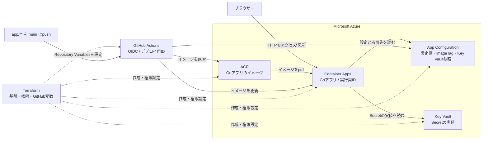

# Azure Container Appsのアプリ更新をTerraformから分ける検証

GoアプリをAzure Container Apps（ACA）で動かし、設定はAzure App Configuration、SecretはAzure Key Vaultから読み込む検証用リポジトリです。TerraformでAzureの基盤とGitHub Actionsの変数を作り、アプリのイメージ更新だけをGitHub Actionsに任せています。

確かめたかったのは、**アプリを更新した後もTerraformに意図しない差分が出ないか**。イメージのタグをApp Configurationで管理し、デプロイ後の `terraform plan` が `No changes` になるところまで確認しました。

## 検証構成

実行用IDはACAがACRからイメージをpullし、GoアプリがApp ConfigurationとKey Vaultを読むために使います。デプロイ用IDはGitHub ActionsがOIDCでAzureへログインするために使います。Secretの実値はApp Configurationには置きません。

## 確認できたこと

- `app/**` の変更を `main` にpushすると、GitHub ActionsがイメージをACRへ送り、App Configurationの `app:imageTag` とACAのイメージを順に更新する。
- ブラウザーの `App Version`、App Configurationのタグ、ACAのイメージタグが一致する。
- その後の `terraform plan` は `No changes`。インフラの管理とアプリのデプロイを分けられた。

## 検証費用（2026年9月22日時点）

9月13日から検証を始め、ACAは動作確認するとき以外は停止しています。Azure Cost Managementの表示は**合計182円、平均26円/日**でした。

費用の大半はACRです。画面にはACRが2行あり、それぞれ173円と9円。Key Vaultは各1円未満、App Configurationは0円で、ACAの費用はこの内訳には表示されていません。

日別では、9月15日が26.54円でした。ACAを止めていても、[ACR Basicには日額の料金](https://azure.microsoft.com/en-us/pricing/details/container-registry/)がかかります。一方、[ACAのConsumptionプランはレプリカがゼロならリソース使用料が発生しません](https://learn.microsoft.com/en-us/azure/container-apps/scale-app)。この約26円/日は**今回の構成・期間の実測**で、ACAを動かした場合も常に同額という意味ではありません。

## どこを見ればよいか

| 場所 | 内容 |
| --- | --- |
| [アプリ](app/README.md) | 画面に出る値と、Goアプリが設定を読む流れ |
| [インフラ](infra/README.md) | 初回構築の順番、Terraformの管理範囲、詰まったところ |
| [デプロイ用ワークフロー](.github/workflows/app-deploy.yaml) | OIDCログイン、イメージのpush、App ConfigurationとACAの更新 |
