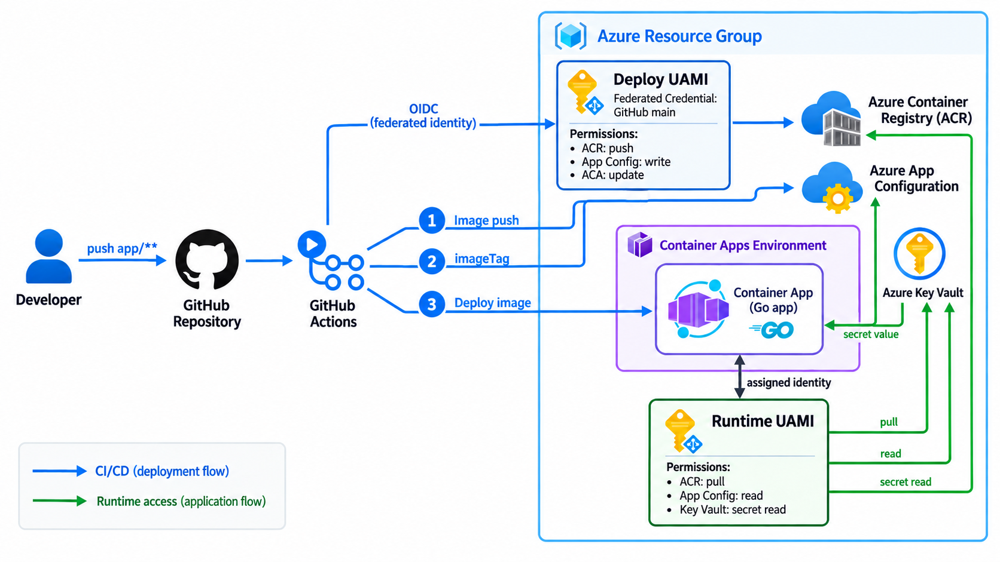
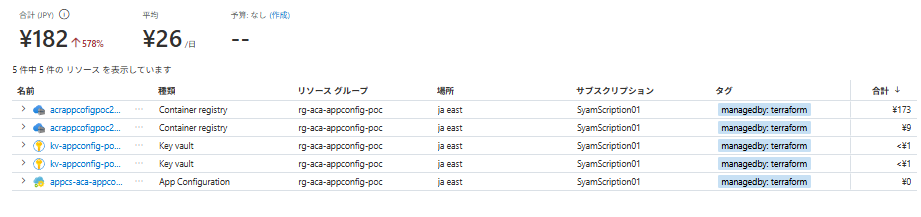
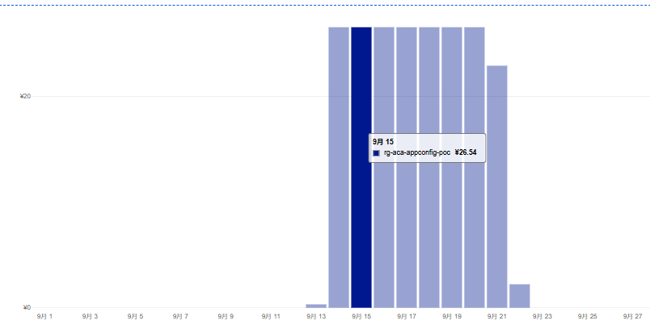

# Azure Container Appsのアプリ更新をTerraformから分ける検証

Zennの記事で扱う、Azure Container Appsのアプリ更新とTerraformのインフラ管理を分ける検証で、実際に使ったコードを置いています。Terraformの構成、Goアプリ、GitHub Actionsのワークフローと、動作確認の結果を残したリポジトリです。

検証の流れや考えたことは記事で紹介し、ここには構成と確認結果をまとめています。App Configurationでイメージタグを管理し、アプリ更新後の `terraform plan` が `No changes` になるところまで確認しました。

## 検証構成

[](docs/images/github-actions-deploy.png)

実行用IDはACAがACRからイメージをpullし、GoアプリがApp ConfigurationとKey Vaultを読むために使います。デプロイ用IDはGitHub ActionsがOIDCでAzureへログインするために使います。Secretの実値はApp Configurationには置きません。

## 確認できたこと

- `app/**` の変更を `main` にpushすると、GitHub ActionsがイメージをACRへ送り、App Configurationの `app:imageTag` とACAのイメージを順に更新する。
- ブラウザーの `App Version`、App Configurationのタグ、ACAのイメージタグが一致する。
- その後の `terraform plan` は `No changes`。インフラの管理とアプリのデプロイを分けられた。

## 検証費用（2026年9月22日時点）

9月13日から検証を始め、ACAは動作確認するとき以外は停止しています。Azure Cost Managementの表示は**合計182円、平均26円/日**でした。



費用の大半はACRです。画面にはACRが2行あり、それぞれ173円と9円。Key Vaultは各1円未満、App Configurationは0円で、ACAの費用はこの内訳には表示されていません。



参考までに、9月15日の費用は26.54円でした。ACAを止めていても、[ACR Basicには日額の料金](https://azure.microsoft.com/en-us/pricing/details/container-registry/)がかかります。検証が終わったら、料金が増え続けないよう `terraform destroy` で片付けます。ACA周りは一度で消えないことがあったので、削除後はAzure側とstateも確認します。

## ディレクトリ構成

```text
.
├── app/                         # Goアプリ、Dockerfile、画面と値の流れ
├── infra/                       # Azure・GitHubのTerraformと構築メモ
├── .github/workflows/
│   └── app-deploy.yaml           # アプリのビルドとデプロイ
├── docs/images/                  # このREADMEで使う費用の画像
├── README.md
└── LICENSE
```

アプリの動きは[app/README.md](app/README.md)、初回構築と動作確認は[infra/README.md](infra/README.md)にまとめています。
