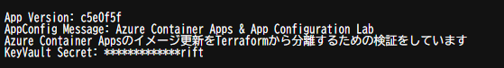
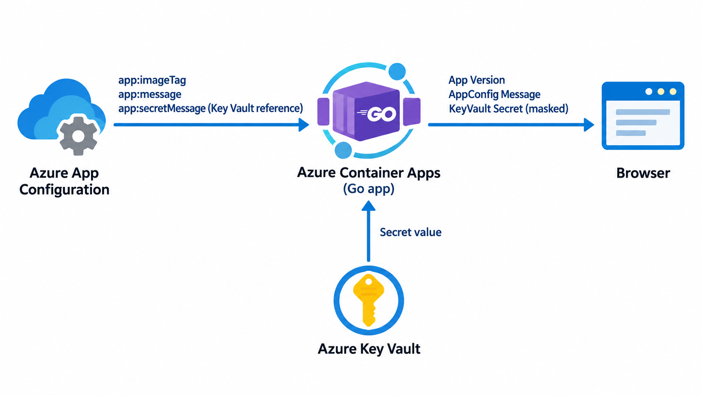

# アプリ

このアプリは、Azure App Configuration から受け取った設定が Azure Container Apps の画面にどう表示されるかを確かめるための、小さな Go アプリです。

## 画面に出るもの

| 表示 | 値の出どころ |
| --- | --- |
| App Version | App Configuration の `app:imageTag` |
| AppConfig Message | App Configuration の `app:message` |
| KeyVault Secret | App Configuration の Key Vault 参照先。画面には末尾4文字だけ表示 |

## 値の流れ

アプリは起動時に設定を一度読み込みます。設定だけを変更しても画面にはすぐ反映されず、新しい設定を読むにはアプリの再起動または新しいリビジョンの起動が必要です。

## アプリの作り

| ファイル・ライブラリ | 役割 |
| --- | --- |
| [`main.go`](main.go) | 起動時に設定を読み、`/` にアクセスすると3つの値を表示する |
| `azureappconfiguration` | App Configuration の `app:*`（`dev`）を読み、Key Vault 参照も解決する |
| `azidentity` | Azure の認証情報を取得する。ACA 上では割り当てたマネージド ID を使う |
| [`Dockerfile`](Dockerfile) | Go でビルドし、実行用イメージにアプリだけを入れる |

## このリポジトリでの役割

Go アプリは設定を読み、画面に表示します。イメージのビルド・ACR への push・ACA の更新は [デプロイ用ワークフロー](../.github/workflows/app-deploy.yaml)が担当します。

> 検証用に、現在のコードは読み込んだ設定をコンテナーログへ出力します。Key Vault の値も含まれるため、実運用ではこのログ出力を削除してください。
